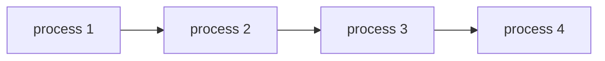

# os

## process

informally speaking, a process is a program in execution.

the program itself is lifeless, but when it is executed, it becomes a process.

the os creates illusion of multiple processes running simultaneously by switching between them very quickly. by **virtualization**, the os makes it appear that each process has its own processor.

time sharing and space sharing is counterparts of each other.

on top these mechanisms resides from **policy**. it is algorithm that decides which process to run next.

Scheduling policy is a function that takes a set of processes and returns a process to run next.

Address space is a set of memory locations that a process can access.

Registers are small memory locations that are part of the processor.
For example :

- Program counter (PC) : holds the address of the next instruction to be executed.
- Frame pointer (FP) : holds the address of the top of the stack.
- Stack pointer (SP) : holds the address of the bottom of the stack.

Process API

- CreateProcess() : creates a new process and its primary thread.
- DestroyProcess() : terminates the specified process and all of its threads.
- Wait for Process() : suspends the execution of the calling thread until the specified process terminates.
- Status of Process() : retrieves the termination status of the specified process.

Transforming a program into a process is called **loading**. it is done by the os.

**loading** is the process of transferring a program from secondary storage to main memory and initializing its execution.

**memory allocation** is the process of reserving space in main memory for a process. Run time stack and heap are two parts of the address space. **Stack** is used for local variables and function parameters. **Heap** is used for dynamically allocated data structures.

**linking** is the process of combining all the object modules into a single executable file.

**i\o related setup** is done by the os. for example, opening a file, reading from a file, writing to a file, closing a file.

The process can be in one of the following states :

- Ready : the process is waiting to be assigned to a processor.
- Running : the process is currently executing on a processor.
- Blocked : the process is waiting for an event to occur, such as an i\o operation to complete.

From ready to running, the process is said to be **scheduled**.
from running to ready or blocked, the process is said to be **descheduled**.

OS keep information about process in some sort of list called **process table**. it contains information about all the processes in the system.

The snipped below is the process table in xv6.

```c
// the registers xv6 will save and restore
// to stop and subsequently restart a process
struct context {
  int eip;
  int esp;
  int ebx;
  int ecx;
  int edx;
  int esi;
  int edi;
  int ebp;
};
// the different states a process can be in
enum proc_state { UNUSED, EMBRYO, SLEEPING,
                  RUNNABLE, RUNNING, ZOMBIE };
// the information xv6 tracks about each process
// including its register context and state
struct proc {
  char *mem;                  // Start of process memory
  uint sz;                    // Size of process memory
  char *kstack;               // Bottom of kernel stack
                              // for this process
  enum proc_state state;      // Process state
  int pid;                    // Process ID
  struct proc *parent;        // Parent process
  void *chan;                 // If !zero, sleeping on chan
  int killed;                 // If !zero, has been killed
  struct file *ofile[NOFILE]; // Open files
  struct inode *cwd;          // Current directory
  struct context context;     // Switch here to run process
  struct trapframe *tf;       // Trap frame for the
                              // current interrupt
};
```

### key process terms

- The register context hold the state of the process. it is used to save and restore the state of the process.

- The process is the major OS abstraction of a running program. At any point in time, the process can be described by its state: the contents of memory in its address space, the contents of CPU registers (including the program counter and stack pointer, among others), and information about I/O (such as open files which can be read or written).

- The process API consists of calls that programs can make related to processes. Typically, this includes creation, destruction, and other useful calls.

- Processes exist in one of many different process states, including running, ready to run, and blocked. Different events (e.g., getting scheduled or descheduled, or waiting for an I/O to complete) transition a process from one of these states to the other.

- A process list contains information about all processes in the system. Each entry is found in what is sometimes called a process control block (PCB), which is really just a structure that contains information about a specific process.

---

RUNNING - the process is using the CPU right now

READY - the process could be using the CPU right now but (alas) some other process is

WAITING - the process is waiting on I/O (e.g., it issued a request to a disk)

DONE - the process is finished executing

## process api

- fork() : creates a new process by duplicating the calling process. the new process, referred to as the child, is an exact duplicate of the calling process, referred to as the parent. the child process is created with a new process ID, but with the same parent process ID as the calling process. the child process is initially in the same state as the parent process. the child process inherits a duplicate of the address space of the parent process, but the two address spaces are completely separate. the child process begins execution at fork().

```c
#include <stdio.h>
#include <stdlib.h>
#include <unistd.h>

int main(int argc, char* argv[]){

  printf("hello world (pid:%d)\n", (int)getpid());
  fflush(stdout);
  int rc = fork();
  if (rc < 0) {
    // fork failed
    fprintf(stderr, "fork failed\n");
    exit(1);
  }
  else if (rc == 0){
    // child (new process)
    printf("hello, I am child (pid:%d)\n", (int)getpid());
  }
  else{
    // parent goes down this path (main)
    printf("hello, I am parent of %d (pid:%d)\n", rc, (int)getpid());
  }
  return 0;
  
}
```

output :

```sh
hello world (pid:1)
hello, I am parent of 2 (pid:1)
hello, I am child (pid:2)
```

- exec() : replaces the current process image with a new process image. the new image is loaded from an executable file whose name is given in filename. the new image is constructed from a copy of the calling process, referred to as the parent process. the new image is constructed by duplicating the parent process, referred to as the child process. the child process is created with a new process ID, but with the same parent process ID as the parent process. the child process is initially in the same state as the parent process. the child process inherits a duplicate of the address space of the parent process, but the two address spaces are completely separate. the child process begins execution at the entry point of the new image.

```c
#include <stdio.h>
#include <stdlib.h>
#include <unistd.h>
#include <string.h>
#include <sys/wait.h>

int main(int argc, char *argv[]){
    printf("hello world (pid:%d)\n", (int) getpid());
    fflush(stdout);
    int rc = fork();
    if (rc < 0) {
        // fork failed; exit
        fprintf(stderr, "fork failed\n");
        exit(1);
    } else if (rc == 0) {
        // child (new process)
        printf("hello, I am child (pid:%d)\n", (int) getpid());
        fflush(stdout);
        char *myargs[3];
        myargs[0] = strdup("wc");   // program: "wc" (word count)
        myargs[1] = strdup("p3.c"); // argument: file to count
        myargs[2] = NULL;           // marks end of array
        execvp(myargs[0], myargs);  // runs word count
        printf("this shouldn't print out");
    } else {
        // parent goes down this path (original process)
        int wc = wait(NULL);
        printf("hello, I am parent of %d (wc:%d) (pid:%d)\n",
        rc, wc, (int) getpid());
    }
    return 0;
}
```

output :

```sh
hello world (pid:29383)
hello, I am child (pid:29384)
      29     107    1030 p3.c
hello, I am parent of 29384 (rc_wait:29384) (pid:29383)
```

- wait() : suspends execution of the calling process until one of its children terminates. the call wait(&status) suspends execution of the calling process until one of its children terminates. the status argument is used to return the termination status of the child process. the wait() call returns the process ID of the terminated child process. if the calling process has no existing unwaited-for children, then wait() returns immediately with a return value of -1. if the calling process has one or more unwaited-for children, then wait() suspends execution of the calling process until one of its children terminates. the status argument is used to return the termination status of the child process. the wait() call returns the process ID of the terminated child process. if the calling process has no existing unwaited-for children, then wait() returns immediately with a return value of -1. if the calling process has one or more unwaited-for children, then wait() suspends execution of the calling process until one of its children terminates. the status argument is used to return the termination status of the child process. the wait() call returns the process ID of the terminated child process. if the calling process has no existing unwaited-for children, then wait() returns immediately with a return value of -1. if the calling process has one or more unwaited-for children, then wait() suspends execution of the calling process until one of its children terminates. the status argument is used to return the termination status of the child process. the wait() call returns the process ID of the terminated child process. if the calling process has no existing unwaited-for children, then wait() returns immediately with a return value of -1. if the calling process has one or more unwaited-for children, then wait() suspends execution of the calling process until one of its children terminates. the status argument is used to return the termination status of the child process. the wait() call returns the process ID of the terminated child process. if the calling process has no existing unwaited-for children, then wait() returns immediately with a return value of -1. if the calling process has one or more unwaited-for children, then wait() suspends execution of the calling process until one of its children terminates. the status argument is used to return the termination status of the child process. the wait() call returns the process ID of the terminated child process. if the calling process has no existing

```c
#include <stdio.h>
#include <stdlib.h>
#include <unistd.h>
#include <sys/wait.h>

int main(int argc, char* argv[])
{
    printf("hello world (pid:%d)\n", (int)getpid());
    fflush(stdout);
    int rc = fork();
    if (rc < 0) { // fork failed; exit
        fprintf(stderr, "fork failed\n");
        exit(1);
    }
    else if (rc == 0) { // child (new process)
        printf("hello, I am child (pid:%d)\n", (int)getpid());
    }
    else { // parent goes down this path (main)
        int rc_wait = wait(NULL);
        printf("hello, I am parent of %d (rc_wait:%d) (pid:%d)\n", rc, rc_wait, (int)getpid());
    }
    return 0;
}
```

output :

```sh
hello world (pid:29266)
hello, I am child (pid:29267)
hello, I am parent of 29267 (rc_wait:29267) (pid:29266)
```

fork only used to create a copy of same process. but exec() is used to create a new process. exec() is used to replace the current process image with a new process image. the new image is loaded from an executable file whose name is given in filename. the new image is constructed from a copy of the calling process, referred to as the parent process. the new image is constructed by duplicating the parent process, referred to as the child process. the child process is created with a new process ID, but with the same parent process ID as the parent process. the child process is initially in the same state as the parent process. the child process inherits a duplicate of the address space of the parent process, but the two address spaces are completely separate. the child process begins execution at the entry point of the new image.

kill() used to send signal to process.
signal() used to handle signal.

### direct execution

#### restricted operations

user mode. Code that runs in user mode is restricted in what it can do.
kernel mode. Code that runs in kernel mode is not restricted in what it can do.

trap instructions simultaneously switch to kernel mode and cause the kernel to handle the trap. The kernel can then switch back to user mode and resume the process.

trap table : a table of trap handlers. The kernel uses the trap table to find the handler for a particular trap.

system-call number : a number that identifies a particular system call. The system-call number is passed to the kernel as part of the trap instruction.

system-call interface : the interface between user programs and the kernel. The system-call interface consists of the trap table and the system-call numbers.

system-call handler : the code in the kernel that handles a particular system call.

privileged operations : operations that are only allowed in kernel mode. For example, the kernel can read and write any memory address, but user programs can only read and write their own memory.

Limited direct execution protocol. LDE is a mechanism that allows the kernel to execute code in user mode. The kernel uses LDE to execute the system-call handler in user mode.

#### switching between processes

First is cooperative approach. In this approach, a process voluntarily gives up the CPU when it is done with its current task. The kernel then schedules another process to run.

Second is preemptive approach. In this approach, the kernel can interrupt a process at any time and schedule another process to run. The kernel can interrupt a process in order to perform a trap, or it can interrupt a process in order to perform a time slice.

Context switch. A context switch is the process of saving the state of a process and then restoring the state of another process. The kernel performs a context switch when it switches from one process to another.

To measure time of context switch using tool like lmbench.

```sh
lmbench -P 1 -N 1000 -s 64 -c context
```

summary

The CPU should support at least two modes of execution: a restricted user mode and a privileged (non-restricted) kernel mode.

Typical user applications run in user mode, and use a system call to trap into the kernel to request operating system services.

The trap instruction saves the register state carefully, changes the hardware status to kernel mode, and jumps into the OS to a pre-specified destination: the trap table.

When the OS finishes servicing a system call, it returns to the user program via another special return-from-trap instruction, which reduces privilege and returns control to the instruction after the trap that jumped into the OS.

The trap tables must be set up by the OS at boot time, and make sure that they cannot be readily modified by user programs. All of this is part of the limited direct execution protocol which runs programs efficiently but without loss of OS control.

Once a program is running, the OS must use hardware mechanisms to ensure the user program does not run forever, namely the timer interrupt. This approach is a non-cooperative approach to CPU scheduling.

Sometimes the OS, during a timer interrupt or system call, might wish to switch from running the current process to a different one, a low-level technique known as a context switch.

### cpu scheduling

**workload** : how many resources are needed to run a process. CPU bound process, I/O bound process.

**turnaround time** : the time from when a process arrives in the ready queue until it finishes execution. turnaround time = completion time - arrival time.

**response time** : the time from when a process arrives in the ready queue until it starts execution. response time = start time - arrival time.

#### first-come, first-served (FCFS) or first in, first out (FIFO)

Convoy effect. A convoy effect occurs when a process that arrives later has to wait for a process that arrived earlier to finish.



Description of the above graph. process 1 is the first process to arrive, so it will be executed first. process 2 is the second process to arrive, so it will be executed second. process 3 is the third process to arrive, so it will be executed third. process 4 is the last process to arrive, so it will be executed last.

#### shortest job first (SJF)

shortest job first (SJF) scheduling. SJF scheduling is a non-preemptive scheduling algorithm. SJF scheduling selects the waiting process with the smallest execution time to execute next. SJF scheduling is optimal in the sense that it minimizes the average waiting time for processes arriving during the execution of the CPU.


Description of the above graph. process 1 is the shortest job, so it will be executed first. process 2 is the second shortest job, so it will be executed second. process 3 is the third shortest job, so it will be executed third. process 4 is the longest job, so it will be executed last.

#### shortest remaining time first (SRTF)

shortest remaining time first (SRTF) scheduling. SRTF scheduling is a preemptive scheduling algorithm. SRTF scheduling selects the waiting process with the smallest remaining execution time to execute next. SRTF scheduling is optimal in the sense that it minimizes the average waiting time for processes arriving during the execution of the CPU.


Description of the above graph. process 1 is the shortest job, so it will be executed first. process 2 is the second shortest job, so it will be executed second. process 3 is the third shortest job, so it will be executed third. process 4 is the longest job, so it will be executed last.

#### round-robin (RR)

round-robin (RR) scheduling. RR scheduling is a preemptive scheduling algorithm. RR scheduling is simple, easy to implement, and starvation-free. RR scheduling is optimal in the sense that it minimizes the average waiting time for processes arriving during the execution of the CPU.

#### priority scheduling

priority scheduling. Priority scheduling is a preemptive scheduling algorithm. Priority scheduling selects the waiting process with the highest priority to execute next. Priority scheduling is optimal in the sense that it minimizes the average waiting time for processes arriving during the execution of the CPU.

#### multi-level queue scheduling

multi-level queue scheduling. Multi-level queue scheduling is a preemptive scheduling algorithm. Multi-level queue scheduling is simple, easy to implement, and starvation-free. Multi-level queue scheduling is optimal in the sense that it minimizes the average waiting time for processes arriving during the execution of the CPU.

#### multi-level feedback queue scheduling

multi-level feedback queue scheduling. Multi-level feedback queue scheduling is a preemptive scheduling algorithm. Multi-level feedback queue scheduling is simple, easy to implement, and starvation-free. Multi-level feedback queue scheduling is optimal in the sense that it minimizes the average waiting time for processes arriving during the execution of the CPU.

#### cfs scheduling

cfs scheduling. CFS scheduling is a preemptive scheduling algorithm. CFS scheduling is simple, easy to implement, and starvation-free. CFS scheduling is optimal in the sense that it minimizes the average waiting time for processes arriving during the execution of the CPU.

#### comparison

| scheduling algorithm | FCFS | SJF | SRTF | RR | priority | multi-level queue | multi-level feedback queue | cfs |
| --- | --- | --- | --- | --- | --- | --- | --- | --- |
| preemptive | no | no | yes | yes | yes | yes | yes | yes |
| starvation-free | no | no | no | yes | no | yes | yes | yes |
| optimal | no | yes | yes | yes | yes | yes | yes | yes |
| average waiting time | no | yes | yes | yes | yes | yes | yes | yes |

#### application in different OS 

| OS | scheduling algorithm |
| --- | --- |
| Linux | CFS |
| Windows | priority |
| Mac OS X | priority |
| Solaris | priority |
| FreeBSD | priority |

